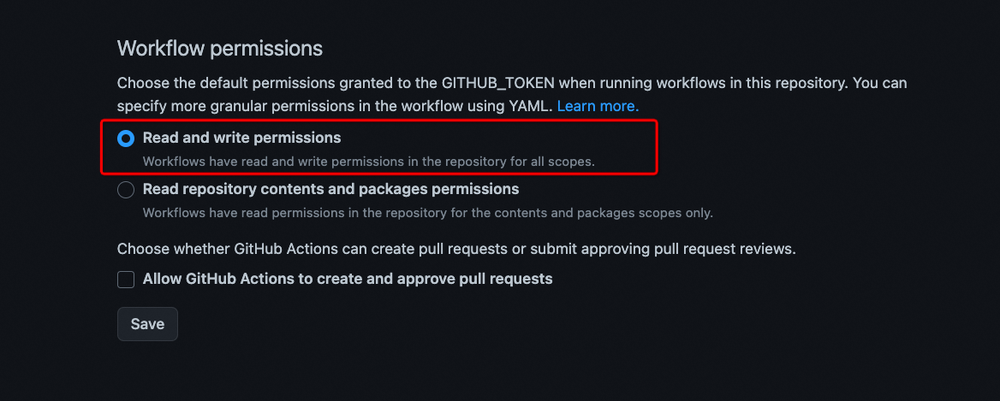

# [初次使用issues写博客](https://github.com/EasonAssassin/blog_with_issues/issues/1)

## 步骤参考

> https://www.jianshu.com/p/8f1079b7efe1

## 步骤修复

> 完全按照上述文章的步骤操作，发现如下问题，需要以下步骤进行修复：

- 需要新建项目根目录下的空文件README.md

- 配置后发现README.md未更新，查看Actions发现是push denied：原因在于github actions对项目没有写入权限。

  - 需要到项目的settings -> Actions -> General -> Workflow permissions -> 勾选read and write permissions

- 首页README.md的博客链接编排请参考main.py中的main方
